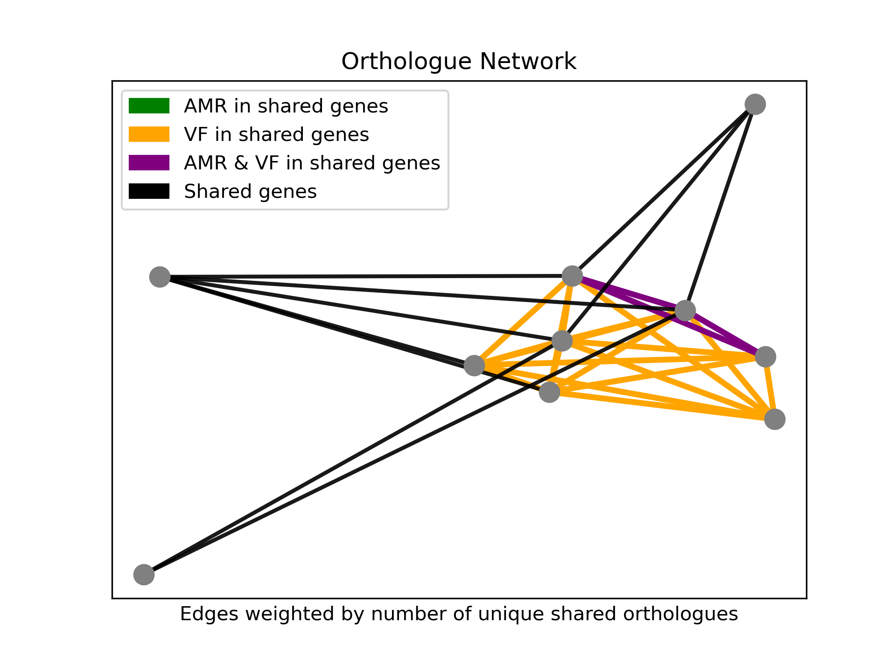

# Shared Gene Network Visualiser

Workflow that identifies and plots the shared gene network between different
fasta files containing contigs/plasmids/chromosomes/GIs 

The resultant graph represents each fasta as a node with an edge to other nodes
weighted by the number of unique shared genes between the fasta files.

Additionally, nodes that share genes annotated as antimicrobial 
resistance (AMR) or virulence factor (VF) genes are highlighted.

There is also an interactive visualisation viewable as a webpage (just navigate to the folder in your browser `file:///home/user/...`).

If a metadata TSV is supplied containing categorical metadata the static and interactive graph can be annotated with a user-defined column.

## Implementation

Input is a folder containing a series of nucleotide fasta files e.g. each file
containing a plasmid sequence.

- ORFs are then identified in each fasta file
- ORFs are annotated for AMR genes using the Resistance Gene Identifier (RGI)
and the Comprehensive Antibiotic Resistance Database (CARD).
- ORFs are also annotated for VFs using BLASTP and the Virulence Factor Database (VFDB)
- Orthologues are identified using proteinortho
- Shared orthologues between fasta files are then rendered as edges in a network
- Edges are weighted by the number of unique shared orthologues between the files (more = shorter edge)
- Edges are also highlighted as per legend if the two fasta files share an AMR or VF gene.

## Running

Install nextflow (requires Java 8 or later and conda):

    curl -s https://get.nextflow.io | bash

Execute workflow (in this example on test data with 7 CPUs), only input is folder containing fasta files

    ./nextflow run main.nf --input_sequences test/data --cpus 7

Optionally include a TSV containing metadata formatted with one column titled "name" corresponding to the name of
each input FASTA (without extension), and a user-specified column to use as categorical metadata e.g.

    name            source
    NC_014508_2     clinical 
    NC_021170_1     clinical
    NC_021996_1     clinical
    NZ_CP012470_1   environmental
    NZ_CP018070_1   environmental
    NZ_CP023426_1   animal
    NZ_CP023785_1   animal
    NZ_CP023810_1   animal
    NZ_CP027503_1   animal
    NZ_LT598667_1   animal

Executing with metadata as follows:

    ./nextflow run main.nf --input_sequences test/data/simple_test --metadata_tsv test/data/simple_test/metadata.tsv --metadata_col source

The workflow will generate a folder of outputs (default to `results` but can be specified in `nextflow.config` or using ``--outdir``:

    results
    ├── 1_orf_prediction
    │   ├── NC_014508_2.faa 
    │   ├── NC_021170_1.faa
    │   ├── NC_021996_1.faa 
    │   ├── NZ_CP012470_1.faa 
    │   ├── NZ_CP018070_1.faa 
    │   ├── NZ_CP023426_1.faa 
    │   ├── NZ_CP023785_1.faa 
    │   ├── NZ_CP023810_1.faa 
    │   ├── NZ_CP027503_1.faa 
    │   └── NZ_LT598667_1.faa 
    ├── 2a_all_orfs
    │   └── all_orfs.faa 
    ├── 2b_annotations
    │   ├── blast_vfs.tsv 
    │   └── rgi_amr.tsv 
    ├── 3_proteinortho
    │   └── plasmid_network.proteinortho.tsv 
    └── 4_network_viz
        ├── network.html
        └── network.png 

Example:

